<!-- Generated by GitHub Profile Agent Console. Edit profile.config.json, then run npm run generate. -->

  <picture>
    <source media="(max-width: 760px) and (prefers-color-scheme: dark)" srcset="./assets/hero/agent-console-0add2b5c-mobile-dark.svg">
    <source media="(max-width: 760px)" srcset="./assets/hero/agent-console-0add2b5c-mobile-light.svg">
    <source media="(prefers-color-scheme: dark)" srcset="./assets/hero/agent-console-0add2b5c-dark.svg">
    <source media="(prefers-color-scheme: light)" srcset="./assets/hero/agent-console-0add2b5c-light.svg">
    
  </picture>

  
  
  
  

## 👋 About Me

Student at Lovely Professional University exploring Python, web development, and building practical projects.

Currently learning and growing my skills in software development, one commit at a time.

## 🔄 Now

- Building Python projects and strengthening fundamentals
- Learning modern web development (HTML, CSS, JavaScript)
- Improving my GitHub profile and contributing to open source

## 🎯 Current Focus

| Area | What I am exploring |
| --- | --- |
| **Python** | Building foundational skills in Python programming through projects and practice. |
| **Web Development** | Learning HTML, CSS, and modern web frameworks to create interactive applications. |

## 💼 Featured Work

| Project | Focus | Why it matters |
| --- | --- | --- |
| [**Portfolio**](https://github.com/Jaskaran9880/Jaskaran9880) | Personal profile | My animated GitHub profile built with the Profile Console starter kit. [Live](https://jaskarans-portfolio.vercel.app) |

## 🧭 Research Direction

I am a student exploring the world of programming through Python and web technologies, focused on building real projects that solve everyday problems.

## 🛠️ Tech Stack

## 📊 GitHub Stats

  
  

## 🏆 GitHub Trophies

  

## 🐍 Contribution Snake

<!-- Snake animation — auto-generated every 12 hours via GitHub Actions -->

  <picture>
    <source media="(prefers-color-scheme: dark)" srcset="https://raw.githubusercontent.com/Jaskaran9880/Jaskaran9880/output/github-snake-dark.svg" />
    <source media="(prefers-color-scheme: light)" srcset="https://raw.githubusercontent.com/Jaskaran9880/Jaskaran9880/output/github-snake.svg" />
    
  </picture>

## 📈 Recent Activity

<!-- AUTO:ACTIVITY:START -->
- Sep 24, 2026: pushed 1 commit to [Jaskaran9880/Jaskaran9880](https://github.com/Jaskaran9880/Jaskaran9880).
- Sep 23, 2026: pushed 1 commit to [Jaskaran9880/NeoFace](https://github.com/Jaskaran9880/NeoFace).
- Sep 22, 2026: pushed 1 commit to [Jaskaran9880/NeoFace](https://github.com/Jaskaran9880/NeoFace).
- Sep 21, 2026: pushed 1 commit to [Jaskaran9880/NeoFace](https://github.com/Jaskaran9880/NeoFace).
- Sep 20, 2026: pushed 1 commit to [Jaskaran9880/NeoFace](https://github.com/Jaskaran9880/NeoFace).
- Sep 18, 2026: pushed 1 commit to [Jaskaran9880/NeoFace](https://github.com/Jaskaran9880/NeoFace).
<!-- AUTO:ACTIVITY:END -->

---

  

  Learning in public — building projects and sharing the journey.

